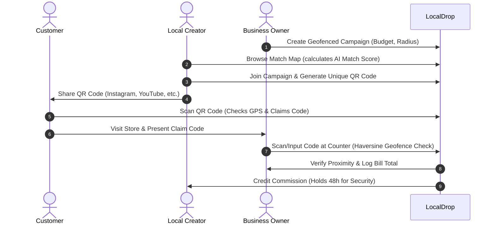

# LocalDrop 📍

🚀 **[Live Demo Sandbox](https://local-drop-delta.vercel.app/login)**

[](https://nextjs.org/)
[](https://expressjs.com/)
[](https://www.postgresql.org/)
[](https://www.docker.com/)

**LocalDrop** is a hyperlocal marketing and collaboration platform designed to connect neighborhood businesses (cafés, salons, boutiques) with local creators (food bloggers, fitness enthusiasts, lifestyle influencers). 

Creators monetize their local influence through trackable, geofenced campaigns, while local brands drive verifiable walk-ins and measure marketing ROI in real-time.

---

## 🏗️ Architecture Flow



---

## ✨ Features

*   **🗺️ Interactive Match Map:** Creators locate nearby business campaigns on a map engine (`Leaflet.js`) and see their calculated **AI Match Score** and predicted walk-in yield.
*   **🤖 AI Matchmaking Engine:** Ranks brand compatibility using a composite scoring mechanism:
    $$\text{Match Score} = 35\% \text{ Geo} + 30\% \text{ Content} + 25\% \text{ Conversion} + 10\% \text{ Affinity}$$
*   **📍 Proximity-based Geofencing:** Employs the **Haversine formula** to verify customer redemption proximity to physical storefronts (checks within 200m buffer) preventing remote fraud.
*   **📊 Real-time Analytics:** Visualizes campaign performance funnels (Views $\rightarrow$ Claims $\rightarrow$ Redemptions $\rightarrow$ Revenue) and viewer heatmaps.
*   **🛡️ Payout Holds & Dispute Center:** Implements a 48-hour security hold period during which businesses can flag incorrect scans for admin arbitration.
*   **💬 Path-Aware AI Assistant:** Incorporates "Droppy", a bubbly chat assistant contextually aware of the page the user is currently viewing.

---

## 🛠️ Technology Stack

*   **Frontend:** Next.js 15 (App Router), React 19, Tailwind CSS, TypeScript, Zustand, React Query, Recharts, Leaflet, Framer Motion.
*   **Backend:** Node.js, Express.js, JWT, bcryptjs, Winston Logger, Express Rate Limit.
*   **Database:** PostgreSQL 15 (relational schema, composite indexing, PL/pgSQL update triggers).
*   **Orchestration:** Docker & Docker Compose.

---

## 📂 Project Structure

```
├── localdrop-backend/       # Express.js REST API Server
│   ├── src/
│   │   ├── controllers/     # Route request handlers
│   │   ├── db/              # PostgreSQL schema, pool, & seeding scripts
│   │   ├── middleware/      # Rate-limiting, authentication, & uploads
│   │   ├── routes/          # REST Endpoint declarations
│   │   ├── services/        # Reusable business logic (QR token signers)
│   │   └── utils/           # Haversine geofencing, crypto, and loggers
│   └── .env                 # Backend configuration
│
└── localdrop-frontend/      # Next.js Frontend SPA Client
    ├── src/
    │   ├── app/             # Routing pages & layout configurations
    │   ├── components/      # UI components, sidebars, charts, and providers
    │   ├── hooks/           # TanStack data hooks & Geolocation triggers
    │   ├── lib/             # Axios API config & Offline demo states
    │   └── store/           # Zustand global state (authentication states)
    └── .env                 # Frontend configuration
```

---

## 🚀 Getting Started

### 📋 Prerequisites
*   Node.js (>= 18)
*   PostgreSQL Database (Local or Dockerized)

### 1. Database Setup
Ensure PostgreSQL is running. Create a database named `localdrop` and configure credentials in the backend environment file.

### 2. Environment Configurations
Configure the respective `.env` files:

*   **Backend Config (`localdrop-backend/.env`):**
    ```env
    PORT=3000
    NODE_ENV=development
    DB_HOST=127.0.0.1
    DB_PORT=5432
    DB_NAME=localdrop
    DB_USER=postgres
    DB_PASSWORD=your_postgres_password
    JWT_ACCESS_SECRET=your_jwt_access_secret
    JWT_REFRESH_SECRET=your_jwt_refresh_secret
    QR_HMAC_SECRET=your_qr_hmac_secret
    FRONTEND_URL=http://127.0.0.1:3001
    ```

*   **Frontend Config (`localdrop-frontend/.env`):**
    ```env
    NEXT_PUBLIC_API_URL=http://127.0.0.1:3000/api
    ```

> [!TIP]
> **Performance Recommendation:** Always use the direct IPv4 loopback IP `127.0.0.1` instead of `localhost` on Windows environments. This prevents DNS lookups from taking the IPv6 resolution route, improving network request speeds by up to **10x** (from ~330ms down to ~35ms per request).

---

### 3. Backend Setup & Seeding
```bash
# Navigate to backend
cd localdrop-backend

# Install dependencies
npm install

# Run database migrations and seed mockup data (Admins, Creators, Businesses, Campaigns)
npm run migrate
npm run migrate:incremental
node src/db/seed.js

# Start backend in development mode
npm run dev
```

---

### 4. Frontend Setup & Run
```bash
# Navigate to frontend
cd ../localdrop-frontend

# Install dependencies
npm install

# Run with Turbopack (speeds up dev compilation)
npm run dev:turbo
```

Open [http://127.0.0.1:3001](http://127.0.0.1:3001) in your browser to view the application.

---

## 🔑 Default Sandbox Accounts

All seeded sandbox accounts share the same default testing password: **`password123`**

| Role | Test Username / Email | Use Case |
| :--- | :--- | :--- |
| **Admin** | `admin@localdrop.com` | Payout approvals, dispute mediation |
| **Creator** | `meera@localdrop.com` | Browse Map, join campaigns, view QR codes |
| **Business** | `shivam@cafe.com` | Create campaigns, scan voucher codes |

---

## ⚡ Deployment (Docker Compose)

To build and orchestrate all services automatically via Docker, run from the folder containing `docker-compose.yml`:

```bash
docker-compose up --build
```

*   **API Service:** [http://localhost:3000/api](http://localhost:3000/api)
*   **Web Client:** [http://localhost:3001](http://localhost:3001)
*   **Database:** `localhost:5432`
